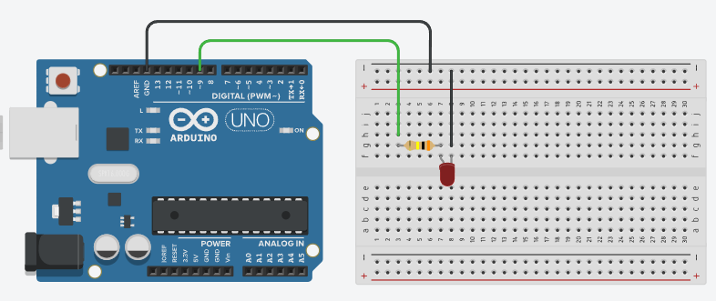
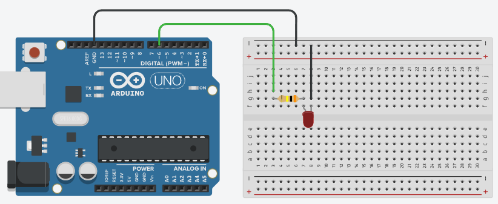
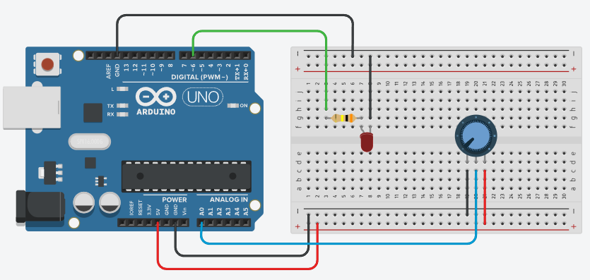
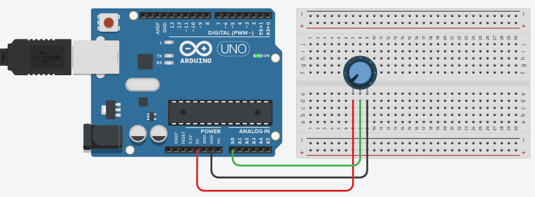
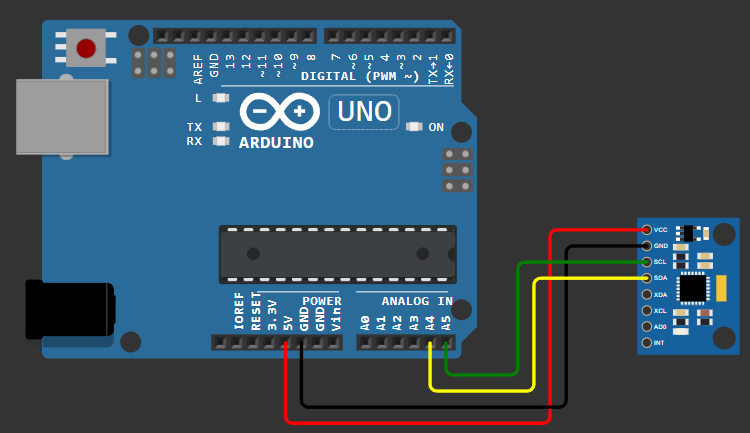

# AVR(ATmega328P) bare-metal

## Overview

This is a learning exploration on bare metal, microcontrollers and all the tools used to achieve embeeded bare metal programming, from the C language, Makefile, avr-toolchain, to how the ATmega328P works internaly, most of the information used in the learning process comes from the [ATmega328P datasheet](https://ww1.microchip.com/downloads/en/DeviceDoc/Atmel-7810-Automotive-Microcontrollers-ATmega328P_Datasheet.pdf).

An arduino uno knock off will be used during the development of this study, this project will be separated into enumerated examples, where each example is built individualy and touches one or more subjects.

In order to develop the files and flash to the MCU we will need to use the avr-toolchain to help compile, generate the hex files and flash to the MCU, it consists on installing some packages that will help us with that.

```sh
sudo apt-get update
sudo apt-get install gcc build-essential
sudo apt-get install gcc-avr binutils-avr avr-libc gdb-avr
sudo apt-get install avrdude
```

Also since i will be using WSL2 as my development environment, we need to attach into WSL2 the usb port of the ATmega328P, to do this the windows tool `usbipd` will be used.

```powershell
winget install usbipd
```

To correctly attach the ATmega328P USB to the WSL2 we will need to `usbipd bind` and `usbipd attach` first in windows so that our WSL can see the connected USB, for this we can follow the [usbipd wiki](https://github.com/dorssel/usbipd-win/wiki/WSL-support).

```powershell
usbipd list
# pay attention to the busid value, it will be something like '2-3'

# the bind command need to be used only one time
usbipd bind --busid BUS_ID_FROM_LIST_CMD

# must attach every time a new WSL session is opened or the ATmega328P USB is connected
usbipd attach --wsl --busid BUS_ID_FROM_LIST_CMD
```

## Build

To build the examples call `make` or `make all`.

To flash the compiled examples to the ATmega328P you do it by calling `make example_name`, something like `make 1_blink`, but first make sure that the **FLASH_PORT** variable in the make file is correct for your system.

## Examples

The header file **avr_atmega328p.h** have some quality of life macros to help code the programs of this project.

- ### 1_blink
  The 'hello world' of embeeded programming, but since this is a bare metal approach we need to manipulate the registers directly to control the built-in LED and make it blink.

  Since im using an Arduino UNO knock off, we can find the arduino micro-controller [pinout diagram](https://content.arduino.cc/assets/Pinout-UNOrev3_latest.pdf#page=1) and search for which pin is responsible for controlling the builtin LED, in this case its the **PB5** pin. But how can we control the PB5 pin, for this we must understand about GPIO and learn a little about the ATmega328P.

  GPIO is short for **general-purpose input/output** and we can read more about it at [wikipedia](https://en.wikipedia.org/wiki/General-purpose_input/output).

  From what i understand, GPIO pins are provided by the MCU with a general-purpose function, meaning we can configure them for different use cases. On the Arduino UNO board, the PB5 pin of the ATmega328P CPU is a GPIO and is used to control the built-in LED.

  In the ATmega328P data sheet we can find information about it at section [I/O-Ports](https://ww1.microchip.com/downloads/en/DeviceDoc/Atmel-7810-Automotive-Microcontrollers-ATmega328P_Datasheet.pdf#page=58). Here it states that there are 3 separated registers responsible for controlling each GPIO pin of the MCU and they are DDRx, PORTxn and PINxn, where 'x' represents the numbering letter for the port and 'n' represents the bit number.

  The DDRx is responsible for selecting the direction of a GPIO pin, it can be either input or output.
  The PORTxn is the data register, it controls what data is the pin receiving or providing.
  The PINxn is the input pin, from what i understand it is where we read the data when the pin is set as input.

  We can now continue with the example, in order to blink the built-in LED (PB5), we must first find the registers that control this pin, since the pin in question is the **PB5** we know that the corresponding DDRx, PORTxn and PINxn will be DDRB, PORTB5 and PINB5. Now searching at the data sheet we can find the [register description](https://ww1.microchip.com/downloads/en/DeviceDoc/Atmel-7810-Automotive-Microcontrollers-ATmega328P_Datasheet.pdf#page=72) where we find the address of each of these registers, PINB5 is the bit 5 of PINB(address 0x23), DDB5 is the bit 5 of DDRB(address 0x24) and PORTB5 is the bit 5 of the PORTB(address 0x25).

  Ok, after understanding more about the ATmega328P we can now code some C, more info inside **1_blink.c**.

- ### 2_button_polling
  Let's build on the previous example by using a push button to toggle the state of an LED. To expand on this example i will not be relying on the built-in LED.

  Since im still learning eletronics, we can take a look at the Arduino built-in examples to guide us on this simple circuits, [button example](https://docs.arduino.cc/built-in-examples/digital/Button/) shows how we can use the PD2 to receive signals of the push down button. For the LED part of the circuit, we could use the built-in LED, but instead let's create a separated LED circuit and connect it to PD7, a circuit example could be found [here](https://docs.arduino.cc/built-in-examples/digital/BlinkWithoutDelay/) just adapt it to PD7.

  

  To correctly read input signals from the button, we must understand pull-up and pull-down resistors, here is a description on [wikipedia](https://en.wikipedia.org/wiki/Pull-up_resistor#:~:text=In%20electronic%20logic%20circuits%2C%20a,absence%20of%20a%20driving%20signal.).

  From my understanding, a pull-up or pull-down resistor solves an issue that occurs when an electronic circuit expects an input signal from a peripheral, especially for digital inputs. This means the circuit expects to receive either a HIGH or LOW voltage from the peripheral, essentially acting like a latch. When this "latch" is in an open state (disconnected), electrical noise can build up, causing errors where the circuit mistakenly reads HIGH when it should be LOW, or vice versa. A pull-up or pull-down resistor helps prevent this by strongly defining the default (idle) state of the input. A pull-up resistor forces the default state to HIGH, while a pull-down resistor forces it to LOW.

  The ATmega328P uses pull-up resistors by default when working with GPIO digital pins as INPUT, this means that when we read the value of the register receiving the signal of the push button(PD2) we will by default receive a 1(HIGH) value for the unpressed button and the 0(LOW) value for the pressed button.

  This example will use a something called GPIO polling, it just means that we will constantly be reading the value of an input GPIO pin. More about how it works in the 2_button_polling.c file.

- ### 3_interrupt
  Next we have some powerful feature, it enables precise control over the program execution [interrupts](https://en.wikipedia.org/wiki/Interrupt). Understanding this is essential to build complex systems since it gives us a really powerful interface to create efficient and responsive programs.

  Essentially an interrupt allows a microcontroller (or any computer) to pause its execution flow, start a specific routine (Interrupt Service Routine) and then resume the execution flow from where it left off. This is essential to handling real-time events.

  The ATmega328P internally maintains what is know as Interrupt Vector Table, its a special piece of memory that maps specific interrupt events to their corresponding interrupt service routine address. When an interrupt happens, the system uses this table and jumps to the corresponding ISR address where it then starts executing the routine, when it is finished a RETI instruction is called, it then returns the program execution from where it left off.

  In the ATmega328P data sheet we can find more info about [reset and interrupt handling](https://ww1.microchip.com/downloads/en/DeviceDoc/Atmel-7810-Automotive-Microcontrollers-ATmega328P_Datasheet.pdf#page=15) or [interrupt vector table](https://ww1.microchip.com/downloads/en/DeviceDoc/Atmel-7810-Automotive-Microcontrollers-ATmega328P_Datasheet.pdf#page=49).

  In this example we will make an LED blink slowly and when we press a push button the LED will blinky fast for some time and then back to blinking slowly, to make this work an interrupt will be triggered when we press the button, then the program will stop and execute a routine that blinks the LED faster, this means that we will need an [external interrupt](https://ww1.microchip.com/downloads/en/DeviceDoc/Atmel-7810-Automotive-Microcontrollers-ATmega328P_Datasheet.pdf#page=53).

  The ATmega328P has many pins to receive external interrupt signals, for this example we will use the INT0 pin (PD2). This means that the EICRA register must be properly configured so that the PD2 pin behaves as INT0. In the [EICRA register description](https://ww1.microchip.com/downloads/en/DeviceDoc/Atmel-7810-Automotive-Microcontrollers-ATmega328P_Datasheet.pdf#page=54), we find that to activate the external interrupt 0 (INT0) we must set the SREG I-flag and corresponding interrupt mask.

  The interrupt mask can be found in the EIMSK register, just bellow the EICRA description. The SREG is a special register, knwon as the [AVR status register](https://ww1.microchip.com/downloads/en/DeviceDoc/Atmel-7810-Automotive-Microcontrollers-ATmega328P_Datasheet.pdf#page=11), which holds flags that store information about the most recently executed arithmetic instructions, along with the global interrupt flag (which we must enabled).

  Additionally, its important to understand how the gcc-avr compiler handles interrupt service routines. The compiler allows us to use something called [function attributes](https://gcc.gnu.org/onlinedocs/gcc/AVR-Function-Attributes.html), this are special flags that modify the behavior of functions. Since a interrupt handler is not a normal function (it does not return with a RET instruction but instead uses RETI), and is stored in a special location (Interrupt Vector Table), the compiler provides specific flags to handle this.

  The avr_atmega328p.h file has a macro definition that helps us set up interrupt handlers together with some more explanations about the attribute flags and how to use them.

  To implement interrupts, we need to configure the MCU by setting specific registers and writting code that interacts with the compiler. More details can be found in the 3_interrupt.c file.

  The same circuit used in the 2_button_polling is used for this example.

- ### 4_timer
  This example we will be working with timers to be more specific the [16-bit Timer/Counter 1](https://ww1.microchip.com/downloads/en/DeviceDoc/Atmel-7810-Automotive-Microcontrollers-ATmega328P_Datasheet.pdf#page=89), a timer/counter is a common peripheral used in many MCUs.

  In the ATmega328P the timer/counter peripheral utilizes a clock source to create a system for acurately comparing timing events. The registers used to work with this timer are, TCNT1 (current timer value), OCR1A/B (timer compare), ICR1 (timer at input signal), TCCR1A/B (timer configuration) and TIMSK1 (timer interrupt).

  To utilize the timer effectively on the ATmega328P, we must understand about the concept of a [prescaler](https://ww1.microchip.com/downloads/en/DeviceDoc/Atmel-7810-Automotive-Microcontrollers-ATmega328P_Datasheet.pdf#page=114). A prescaler is a component that divides the input clock frequency, producing a slower clock rate derived from the input clock. If we take as example the ATmega328P CPU clock (16Mhz) the prescaler would be able to receive this clock speed and output a scaled down version of it, this is useful because since our timer register can only hold a number between 0-65335 it would overflow quickly, limiting the duration of measurable events. Utilizing a prescaler and slowing down the 16Mhz clock to for example a 15625hz clock, this would give us a bigger wait time between ticks (making it less precise for smaller events) but a much bigger time window for a 16-bit timer, it would be 65335/15625 seconds (aprox 4.2 seconds).

  To configure the timers, we use the TCCRnA and TCCRnB registers. These registers allows us to configure the prescaler, waveform generation mode (used on PWM) and compare match output modes. The output compare registers OCRnA and OCRnB, are used to define the values at which the timer compares its counter, it then could trigger specific actions at comparisson.

  This example we will blink an LED every second (precisely) using the timer peripheral, we dont need to use a 'hacky' loop to delay events anymore. More on 4_timer.c file.

  

- ### 5_pwm
  Now, extending more on the subject of timers, we will use the timer module to create what is known as [PWM signal](https://en.wikipedia.org/wiki/Pulse-width_modulation). This technique is commonly used to control the power delivered to a component.

  In this example we will build something similar to the 4_timer example, but instead of blinking the LED from 0 (LOW) to 1 (HIGH), we will create a 'gradient' effect between these two states, making the LED gradually dim in and out. To explore more on the ATmega328P capabilities, we will use its [8-bit Timer/Counter0 with PWM](https://ww1.microchip.com/downloads/en/DeviceDoc/Atmel-7810-Automotive-Microcontrollers-ATmega328P_Datasheet.pdf#page=74). In the last example we used the timer in compare output mode, non-PWM Mode, meaning the timer was only counting and not performing any additional behavior, in this example we will be using the timer to not only generate the output to the LED but also to trigger interrupt routines so we can increment and decrement the duty cycle of the PWM output, more on duty cycle next.

  The idea behind a PWM signal is to use a timer to control the output power delivery over time. To achieve this, we introduce the concept of **duty cycle**, which defines how long the output remains HIGH within a period of time. A duty cycle of 50% will have the output as HIGH for half of the period and LOW for the other half, generating then a perceived half power, if HIGH = 5v half of that we be 2.5v, the PWM signal does not generate 2.5v but instead creates a perceived 2.5v.

  In the ATmega328P timer module supports multiple modes of operation: non-PWM, fast-PWM and phase correct PWM. In fast PWM mode, the timer counts from BOTTOM to TOP and resets back to BOTTOM immediately, producing a sawtooth wave. In phase correct PWM mode, the timer counts from BOTTOM to TOP and then back from TOP to BOTTOM, creating a symmetrical triangular wave. For our example we will be using the simpler fast PWM mode.

  Because we are generating a PWM signal, the timer will not simply count to one second and toggle the LED. Instead, it will generate the perceived power output based on its current duty cycle, that is defined by how the timer is configured, in our case we will make as when we reach OCR0A the OC0A will be set as LOW and after the timer overflow the OC0A will be HIGH.

  More on how this works on 5_timer.c file.

  

- ### 6_adc
  Next we will work with something called [Analog to Digital Converter (ADC)](https://ww1.microchip.com/downloads/en/DeviceDoc/Atmel-7810-Automotive-Microcontrollers-ATmega328P_Datasheet.pdf#page=205). This peripheral works by converting an analog signal it to a digital signal allowing us to work with it as a value inside our programs. ADCs are commonly used to read input from components that provide analog values, such as sensors and potentiometers.

  In the ATmega328P the ADC works by converting the analog signal to a 10-bit digital signal value by comparing the input voltage (input pin) to a reference voltage. The conversion process is not instantaneous, because of this the ATmega328P ADC peripheral have 3 modes of operation, single conversion mode, free running mode and trigger mode, each has its own trade-off between response time and the number of cycles required for a conversion.

  A precise conversion requires multiple clock cycles. To make sure the conversion is precise, the ADC uses a prescaler to adjust the input clock speed, where for the ATmega328P the conversion clock speed must be between 50-200Khz for a precise 10-bit digital value conversion. Also since the ADC needs time to complete a conversion and it must be shared by all the analog pins, the ADC utilizes then a multiplexer (MUX) to select the input pin, when a conversion is in place we cannot convert any other analog signals.

  The ADC is a more complex peripheral, is better to study more about it seperately for a deeper understanding. Here is the ADC [wiki](https://en.wikipedia.org/wiki/Analog-to-digital_converter).

  For this example we will build a simple circuit that reads the analog signal from a potentiometer and after converting it to a digital value we dim an LED using a PWM signal based on it.

  For a better understanding on how this works, refer to 6_adc.c file.

  

- ### 7_usart
  The [USART](https://ww1.microchip.com/downloads/en/DeviceDoc/Atmel-7810-Automotive-Microcontrollers-ATmega328P_Datasheet.pdf#page=143) is a serial communication peripheral utilized as the mean of communication between 2 components or systems, its flexible and simple.

  The simplicity of the USART peripheral lives in the idea that utilizes a single pin for reading and a single pin for writing data, this makes it compatible with many components/systems without much rassle. Even tho the USART is not the fastest mean of communication, together with simplicity it can levarage asynchronous communication making it fairly reliable.

  In order to make the 2 components/systems communicate reliably, we must define a [baud rate](https://en.wikipedia.org/wiki/Baud) for both systems to work with when reading/writing data to one another. In the ATmega328P the baud rate is generated by utilizing the mcu clock (16Mhz) together with a specific type of prescaler only used by this peripheral, in order to properly configure the USART we must calculate the correct value for the UBRRn register with the [formulas](https://ww1.microchip.com/downloads/en/DeviceDoc/Atmel-7810-Automotive-Microcontrollers-ATmega328P_Datasheet.pdf#page=146). After defining the baud rate we just need to configure the mode of operation.

  To see what the ATmega328P is sending to our computer we need to have a serial monitor tool, the tool im using is called `screen`, this is how im using it:

  ```sh
  sudo screen /dev/ttyUSB0 9600
  ```

  This will open a terminal interface and start receiving data from the ATmega328P, the screen tool uses **<Ctrl + a>** before any command for its hotkeys, to see other options do **<Ctrl + a>** followed by **?** and to quit do **<Ctrl + a>** -> **k** -> **y**.

  In this example we will be reading the input from a potentiometer and sending the digital value of it via USART, where we will be able to see when we change the potentiometer position in the serial monitor `screen`.

  More about how to configure and use the USART in the 7_usart.c file.

  

- ### 8_i2c
  This example we will work with another communication interface, the I2C interface. In summary the I2C is a communication interface utilized for communication between two or more integrated circuits, which utilizes 2 bidirectional bus lines to achieve communication between two or more integrated circuits. In the ATmega328P this interface can be found under [2-wire Serial Interface](https://ww1.microchip.com/downloads/en/DeviceDoc/Atmel-7810-Automotive-Microcontrollers-ATmega328P_Datasheet.pdf#page=173).

  Even though the I2C is simple in that it uses only two wires, its operation can be complex. After searching for aditional content on how the I2C operates i found this [doc](https://ece-classes.usc.edu/ee459/library/documents/I2C.pdf) explaining it in the context of the ATmega328P that should help us understand better.

  Before starting the example we need to have another component capable to communicate via I2C, im using an accelerometer and gyroscope module for this example, the [MPU6050](https://components101.com/sensors/mpu6050-module). But i believe any other component could be used instead with minor changes to the code since this will be a more generic example.

  Each I2C device has a unique 7-bit address, with the 8th bit reserved for indicating whether the operation is a read or write.

  All devices utilizing the I2C have an identifiable address and this value is fixed by the manufacturer of the device. This address is how we can target the device for communication, each I2C device has a unique 7-bit address, with the 8th bit reserved for indicating whether the operation is a read or write. For the MPU6050 the address can be found on its [data sheet](https://components101.com/sites/default/files/component_datasheet/MPU6050-DataSheet.pdf#page=15), being the address **0b01101000** in binary or **0x68** in hex.

  The 2 bus lines utilized by the I2C interface are a clock line (SCL) and a data line (SDA). Some terminology will help us understand how it works, the I2C have 4 distinct notions of a device, **master** is the device that initiates the I2C and is the source of the SCL, **slave** is the device addressed by the master, **transmitter** is the device writing data to the SDA bus line and **receiver** is the device reading from the SDA line.

  For the ATmega328P, when it operates as the master it utilizes the [Bit Rate Generator Unit](https://ww1.microchip.com/downloads/en/DeviceDoc/Atmel-7810-Automotive-Microcontrollers-ATmega328P_Datasheet.pdf#page=180) in order to control the clock provided to the I2C SCL line. Similar to USART, the SCL clock is configured by writing to the TWBR register a value that will change the MCU clock and output a prescaled clock, this clock must match the requirements of the components the ATmega328P it is interacting with. The MPU6050 module MAX SCL clock can be found [here](https://components101.com/sites/default/files/component_datasheet/MPU6050-DataSheet.pdf#page=15) under parameter I2C Operating Frequency, being 100kHz for standard-mode and 400kHz for fast-mode.

  Better than trying to explain how the I2C communication happen, there is this reference under [Using the TWI](https://ww1.microchip.com/downloads/en/DeviceDoc/Atmel-7810-Automotive-Microcontrollers-ATmega328P_Datasheet.pdf#page=181) where it goes thru an example and describes step by step what is happening in order for it all to work and its followed by some code examples.

  For this example we will first initialize serial communication with our computer using [USART](###7_usart) and initialize a I2C communication with the MPU6050 accelerometer and gyroscope module. After initialization we will constantly read the values of from the MPU6050 and send it to our computer via USART so it can be displayed and we can visually see changes when we interact with the MPU6050.

  More about I2C and how we make it work on the 8_i2c.c file.

  
