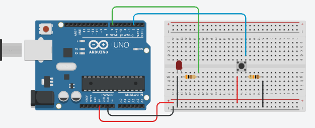

# AVR(ATmega328P) bare-metal

## Overview

This is a learning exploration on bare metal, microcontrollers and all the tools used to achieve embeeded bare metal programming, from the C language, Makefile, to how the ATmega328P works internaly, most of the information used in the learning process comes from the [ATmega328P datasheet](https://ww1.microchip.com/downloads/en/DeviceDoc/Atmel-7810-Automotive-Microcontrollers-ATmega328P_Datasheet.pdf).

A arduino uno knock off will be used during the development of this study, this project will be separated into enumerated examples, where each example is built individualy and touches one or more subjects.

In order to develop the files and flash to the MCU, we will need to use the avr-toolchain to help compile, generate the hex files and flash to the MCU, it consists on installing some packages that will help us with that.

```sh
sudo apt-get update
sudo apt-get install gcc build-essential
sudo apt-get install gcc-avr binutils-avr avr-libc gdb-avr
sudo apt-get install avrdude
```

Also since i will be using WSL2 as my development environment, we need to attach into WSL the usb port of the ATmega328P, to do this `usbipd` will be used.

```powershell
winget install usbipd
```

To correctly attach the ATmega328P USB to the WSL2 we will need to `usbipd bind` and `usbipd attach` first in windows so that our WSL can see the connected USB, for this we can follow the [usbipd wiki](https://github.com/dorssel/usbipd-win/wiki/WSL-support).


## Build

To build the examples call `make` or `make all`.

To flash the compiled examples to the ATmega328P you do it by calling `make example_name`, something like `make 1_blink`, but first make sure that the **FLASH_PORT** variable in the make file is correct for your system.

## GPIO

In MCUs like the ATmega328P, GPIO (General-Purpose Input/Output) pins are components that interfaces with external devices, each GPIO pin can be configured as either an input or an output, and this data direction controled by the Data Direction Register (DDR) that lives only in software.

The ATmega328P MCU has a dedicated set of GPIO pins organized into ports in software, such as PORTB, each pin in the port is associated with a bit in the DDR register and mapped to a physical PIN in the MCU.

To configure a PIN as input we write HIGH(1) to the associated DDR bit and to configure it as an output we write LOW(0) to that bit, this software configuration reflects in the physical interface of the pin.

When a pin is configured as an output, writing a logical HIGH(1) to the corresponding bit in the PORT register sets the physical pin to a high voltage level, while writing a logical LOW(0) sets it to a low voltage level. This allows the MCU to control external components such as LEDs, motors, or relays.

Additionally, the MCU introduces a concept known as pin multiplexing. In many MCUs, including the ATmega328P, GPIO pins can be shared by multiple internal peripherals or functions through the use of a multiplexer. This means that a single physical pin can be connected to different internal registers or peripherals, depending on the configuration set by the MCU firmware.

For example, a GPIO pin may be used as a digital input in one configuration, but it can also be configured to serve as the clock input for a timer/counter peripheral in another configuration. The multiplexer allows the MCU to dynamically allocate pin functionality, providing flexibility in utilizing the limited number of GPIO pins available on the chip.

## GPIO polling

The idea of GPIO polling is such as we monitor the state of a input pin. This technique the MCU constantly checks the state of the pin that was configured as an input pin, this makes the MCU have direct access to a hardware device where it can check its state during code execution.

One limitation of GPIO polling is that it may introduce latency in the system where real-time responses to hardware events are necessary, in those cases we can use interrupt signals to achieve a more time-sensitive approach.

A disavantage of GPIO polling compared to an interrupt system is the consumption of CPU cycles every time the pin value needs to be checked. In some sense GPIO polling is "slow" if compared to a system that levarages interrupt signal to change the program execution. In counter part GPIO polling makes the program deterministic and predictable.

## Interrupts

Interrupt functionality allows us to pause the current execution of the program and execute a subroutine predefined in the Interrupt Vector Table (IVT), these interrupt subroutines are stored in the table when we setup/flash the firmware of the MCU.

This functionality can be achieved in several ways: by using pins configured to trigger interrupt signals upon meeting specific conditions, such as a rising edge(going from HIGH to LOW), by setting the MCU to trigger interrupts at regular intervals using internal timers that count clock cycles, or by configuring peripherals to trigger an interrupt when they complete a specific task, such as finishing a data transfer or completing an ADC conversion.

These methods enable the MCU to respond to external and internal events in real-time, enhancing its flexibility and performance in handling various tasks.

## Timers

The timer/counter peripheral is a piece of hardware that increments a register based on an input clock cycle, which can be prescaled by the timer itself. This means that the timer can derive its clock from the CPU clock or an external clock source. When using the CPU clock, the timer operates synchronously with the CPU, ensuring reliable timing and event scheduling.

The timer is essentially a counter combined with a comparator. It functions similarly to an Arithmetic Logic Unit (ALU) in that it can compare the current count value with a predefined value. If the current count matches the configured condition, the counter triggers a specific action. For this create this conditions it operates around 3 main values, the BOTTOM value(normaly 0), the current count and the TOP value, that can be either the maximum value or a preset value.

There are three main output actions that can be configured when a timer reaches its condition: toggle a pin, clear a pin, and set a pin. In addition to controlling pin states, the timer can trigger interrupt signals under certain conditions. This capability allows the timer to generate precise time-based events or perform specific tasks at regular intervals, making it a powerful tool.

A timer also have multiple modes of operation, making it possible to operate its output as a PWM signal.

## PWM

A PWM (Pulse Width Modulation) signal is a digital signal that alternates between HIGH and LOW states. The rapid changes between these states allow us to control the duration of cycles that stay HIGH and the amount of time they stay LOW, effectively modulating the output to simulate an analog signal. The proportion of time the signal remains in each state is called the duty cycle.

In the ATmega328P, we can create PWM signals using the timer peripheral, which can be configured in either Fast PWM Mode or Phase Correct PWM Mode. In Fast PWM Mode, the timer counts up until it reaches the TOP value and then resets to the BOTTOM, repeating this process. In Phase Correct PWM Mode, the timer counts up until it reaches the TOP value, then reverses direction and counts down back to the BOTTOM. This mode, as the name indicates, provides more precision, allowing for finer control over the PWM signal.

## ADC(Analog to Digital Converter)

The ADC peripheral in the ATmega328P converts analog signals into digital signals, allowing us to process them within our program. The ADC works by using a reference voltage and measuring the potential difference between this reference voltage and the input voltage. This difference is then converted into a digital value, with a resolution of up to 10 bits in the case of the ATmega328P. This conversion process is handled entirely by the hardware.

To achieve accurate and reliable ADC readings, we must configure the ADC correctly. One key configuration is setting the prescaler value, which determines the division factor for the system clock to produce the ADC clock. The prescaler ensures that the ADC operates within an optimal frequency range, balancing conversion speed and precision.

The ADC can operate in different modes. It can perform continuous conversions, repeatedly converting the analog input without interruption, or it can be configured to start a conversion only when a specific flag is set. Additionally, the ADC can trigger an interrupt when a conversion completes or other specified conditions are met.

## UART(Universal Asynchronous Receiver/Transmitter)

The UART is a peripheral that enables asynchronous communication between two devices. Unlike synchronous communication protocols that rely on paired clock cycles, the UART protocol uses a start bit and a stop bit to signal the beginning and end of data transmission.

Since it relies on the baud rate, UART communication can be slower compared to other protocols like SPI and I2C, but it compensates with simplicity and makes it ideal for compact and easy to use data transfer.

UART is especially useful for communication between components that do not share other communication protocols, as it only requires two wires, one for transmiting and one for receiving, this minimal wiring requirement makes it a versatile choice for various applications where simplicity and ease of use are necessary.

## Examples
- 1_blink: This is the classic blink LED example, MCUs normaly have multiplexer systems so the pins of the MCU can be shared depending on the internal peripheral that is interacting with it or the CPU.

- 2_button_polling: Here we setup a button and a LED, where when the button is pressed the LED lights up, to achieve this we use a technique called GPIO polling.

- 3_interrupt: In this example we flicker an LED slowly, we also setup and utilize an external interrupt in order to trigger a routine that flickers an led faster 10 times.

- 4_timers: A timer is configured to toggle a pin connected to an LED, where it will blink it every second.

- 5_pwm: Utilizing the 8-bit timer to generate a PWM signal and fade in/out an LED.

- 6_adc: Reading the analog input from a potentiometer and with it controlling the PWM duty cycle, this PWM signal controls a LED brightness.

- 7_uart: In this example we read the analog signal from a potentiometer and transmit it utilizing the UART protocol.


## Examples

The header file *avr_atmega328p.h* have some quality of life macros to help code the programs of this project.

- ### 1_blink
  The 'hello world' of embeeded programming, but since this is a bare metal approach we need to manipulate the registers directly to control the built-in LED and make it blink.

  Since im using an Arduino UNO knock off, we can find the arduino micro-controller [pinout diagram](https://content.arduino.cc/assets/Pinout-UNOrev3_latest.pdf#page=1) and search for which pin is responsible for controlling the builtin LED, in this case its the *PB5* pin. But how can we control the PB5 pin, for this we must understand about GPIO and learn a little about the ATmega328P.

  GPIO is short for *general-purpose input/output* and we can read more about it at [wikipedia](https://en.wikipedia.org/wiki/General-purpose_input/output).

  From what i understand, GPIO pins are provided by the MCU with a general-purpose function, meaning we can configure them for different use cases. On the Arduino UNO board, the PB5 pin of the ATmega328P CPU is a GPIO and is used to control the built-in LED.

  In the ATmega328P data sheet we can find information about it at section [I/O-Ports](https://ww1.microchip.com/downloads/en/DeviceDoc/Atmel-7810-Automotive-Microcontrollers-ATmega328P_Datasheet.pdf#page=58). Here it states that there are 3 separated registers responsible for controlling each GPIO pin of the MCU and they are DDRx, PORTxn and PINxn, where 'x' represents the numbering letter for the port and 'n' represents the bit number.

  The DDRx is responsible for selecting the direction of a GPIO pin, it can be either input or output.
  The PORTxn is the data register, it controls what data is the pin receiving or providing.
  The PINxn is the input pin, from what i understand it is where we read the data when the pin is set as input.

  We can now continue with the example, in order to blink the built-in LED (PB5), we must first find the registers that control this pin, since the pin in question is the *PB5* we know that the corresponding DDRx, PORTxn and PINxn will be DDRB, PORTB5 and PINB5. Now searching at the data sheet we can find the [register description](https://ww1.microchip.com/downloads/en/DeviceDoc/Atmel-7810-Automotive-Microcontrollers-ATmega328P_Datasheet.pdf#page=72) where we find the address of each of these registers, PINB5 is the bit 5 of PINB(address 0x23), DDB5 is the bit 5 of DDRB(address 0x24) and PORTB5 is the bit 5 of the PORTB(address 0x25).

  Ok, after understanding more about the ATmega328P we can now code some C, more info inside *1_blink.c*.

- ### 2_button_polling
  Let's build on the previous example by using a push button to toggle the state of an LED. To expand on this example i will not be relying on the built-in LED.

  Since im still learning eletronics, we can take a look at the Arduino built-in examples to guide us on this simple circuits, [button example](https://docs.arduino.cc/built-in-examples/digital/Button/) shows how we can use the PD2 to receive signals of the push down button. For the LED part of the circuit, we could use the built-in LED, but instead let's create a separated LED circuit and connect it to PD7, a circuit example could be found [here](https://docs.arduino.cc/built-in-examples/digital/BlinkWithoutDelay/) just adapt it to PD7.

  

  To correctly read input signals from the button, we must understand pull-up and pull-down resistors, here is a description on [wikipedia](https://en.wikipedia.org/wiki/Pull-up_resistor#:~:text=In%20electronic%20logic%20circuits%2C%20a,absence%20of%20a%20driving%20signal.).

  From my understanding, a pull-up or pull-down resistor solves an issue that occurs when an electronic circuit expects an input signal from a peripheral, especially for digital inputs. This means the circuit expects to receive either a HIGH or LOW voltage from the peripheral, essentially acting like a latch. When this "latch" is in an open state (disconnected), electrical noise can build up, causing errors where the circuit mistakenly reads HIGH when it should be LOW, or vice versa. A pull-up or pull-down resistor helps prevent this by strongly defining the default (idle) state of the input. A pull-up resistor forces the default state to HIGH, while a pull-down resistor forces it to LOW.

  The ATmega328P uses pull-up resistors by default when working with GPIO digital pins as INPUT, this means that when we read the value of the register receiving the signal of the push button(PD2) we will by default receive a 1(HIGH) value for the unpressed button and the 0(LOW) value for the pressed button.

  This example will use a something called GPIO polling, it just means that we will constantly be reading the value of an input GPIO pin. More about how it works in the 2_button_polling.c file.
